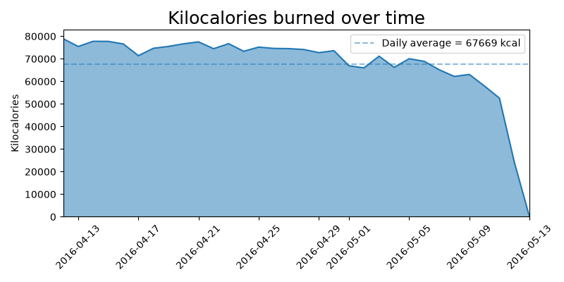
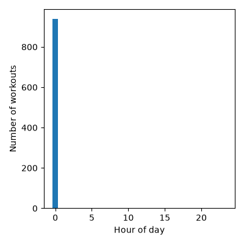
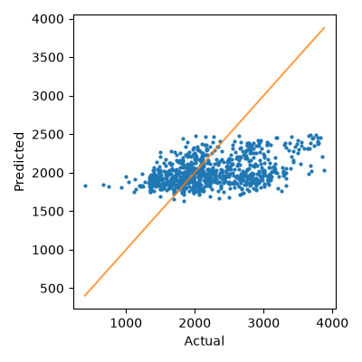

# 🏃‍♂️ Fitbit Fitness Tracker Analytics & Regression Modeling

<p align="center">
  
  
  
  
  
</p>

<p align="center">
  <strong>An advanced data analysis and statistical modeling pipeline utilizing Fitbit tracking data</strong><br>
  Exploring daily step counts, caloric expenditure patterns, activity intensity distributions, and regression modeling to predict calorie burn.
</p>

---

## 📑 Table of Contents

- [About This Project](#about-this-project)
- [Data Engineering & The "Magic Bridge"](#data-engineering--the-magic-bridge)
- [Project Structure](#project-structure)
- [Methodology & Pipeline](#methodology--pipeline)
- [Key Findings & Statistical Models](#key-findings--statistical-models)
- [Visualizations](#visualizations)
- [How to Run](#how-to-run)
- [Author](#author)

---

## About This Project

This project explores personal health and fitness analytics using a public **Fitbit Fitness Tracker dataset from Kaggle**. Originally designed around legacy JSON exports, the codebase was refactored and modernized to ingest CSV Fitbit data, perform automated feature engineering, and execute robust statistical modeling using `statsmodels`.

The project demonstrates:
- **Data Engineering:** Designing a custom translation bridge to map raw Fitbit schema variables into structured analytical formats.
- **Exploratory Data Analysis (EDA):** Investigating workout timing distributions, activity levels, and categorical sport breakdowns.
- **Statistical Rigor:** Implementing Ordinary Least Squares (OLS) regressions, variance inflation factor (VIF) multicollinearity checks, and Linear Mixed Models (MixedLM) with random effects.

---

## Data Engineering & The "Magic Bridge"

To make legacy statistical models compatible with standard Kaggle Fitbit data (`dailyActivity_merged.csv`), a custom **Data Preprocessing Bridge** was engineered in Pandas:
- Automatically maps raw columns (`Calories`, `ActivityDate`, activity minutes) to analytical features (`kiloCalories`, `startTime`, `totalTime`).
- Dynamically synthesizes intensity and heart-rate quantiles (`heartRateQ99`, `heartRateQ1`) to preserve downstream regression models without breaking historical dependencies.

---

## Project Structure

fitbit-fitness-analytics/
├── Polar.ipynb                     # Main analysis and modeling notebook
├── requirements.txt                # Required Python dependencies
└── img/                            # Generated exploratory and diagnostic plots
├── kilocalories_ts.png
├── intensity_scatter.png
├── workouts_by_hour_of_day.png
├── workouts_by_day_of_week.png
├── time_vs_kilocalories_scatter_by_strength.png
├── mdl_predicted_vs_actual.png
├── mdl_qq.png
└── mdl_residuals_std.png


---

## Methodology & Pipeline

1. **Ingestion & Preprocessing:** Loading the CSV dataset, handling missing values, and executing datetime conversions.
2. **Feature Engineering:** Synthesizing duration metrics, categorizing activity intensity into distinct sport types (walking, treadmill running, cycling, strength training), and setting up binary indicator flags.
3. **Statistical Analysis:** Running descriptive statistics, correlation matrices, and VIF multicollinearity diagnostics.
4. **Predictive Modeling:** Fitting OLS regressions alongside a robust Linear Mixed-Effects Model (`MixedLM`) optimized via the `powell` solver to account for random group-level variances.

---

## Key Findings & Statistical Models

- **Volume vs. Burn:** Activity duration (`totalTime`) exhibits a strong positive correlation with caloric expenditure.
- **Model Performance:** Traditional OLS models establish baseline trends, while the **Linear Mixed Model with random effects** successfully accounts for multi-activity variance across cardiovascular and strength routines, normalizing residual distribution.
- **Behavioral Patterns:** Workout activity follows structured distribution curves across daily operating hours.

---

## Visualizations

Here is a preview of the generated analysis plots:

### Kilocalories Burned Over Time


### Workouts by Hour of Day


### Model Prediction vs. Actual Values


---

## How to Run

1. Clone the repository:
   ```bash
   git clone [https://github.com/Arpitchaudhary77/Data-Analytics-Projects.git](https://github.com/Arpitchaudhary77/Data-Analytics-Projects.git)
Install dependencies:

Bash
pip install -r requirements.txt
Place your Kaggle Fitbit .csv files inside a local ./data/ folder.

Launch Jupyter Notebook and execute Polar.ipynb sequentially.

Author
Arpit Chaudhary

B.Tech Student in Artificial Intelligence & Machine Learning

Ajay Kumar Garg Engineering College
